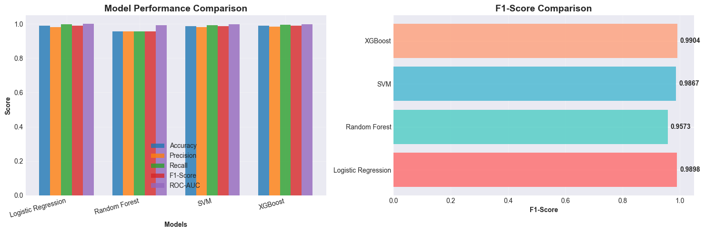
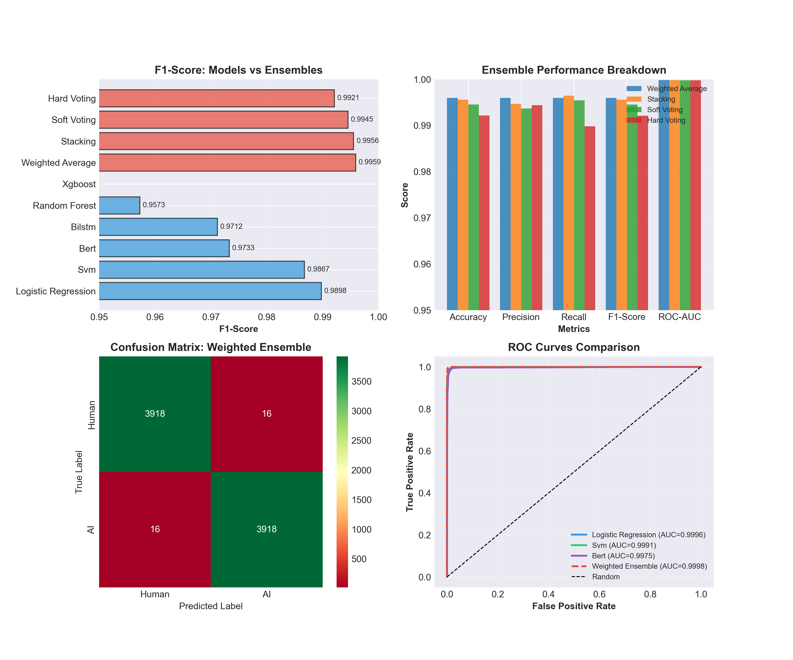
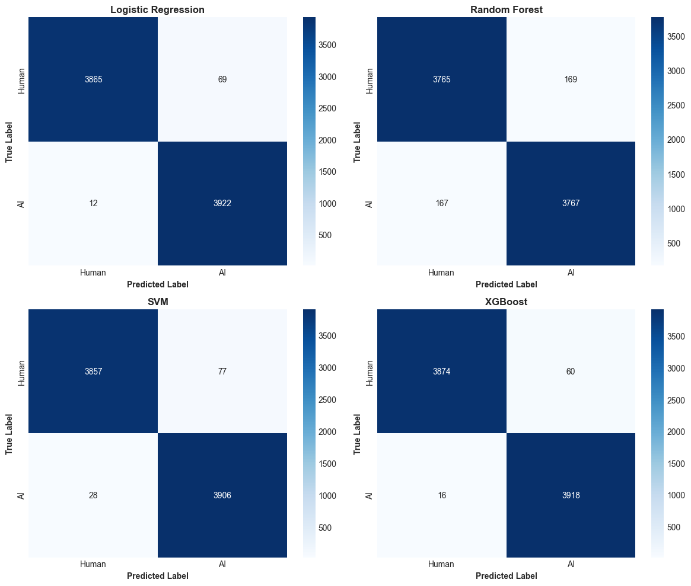
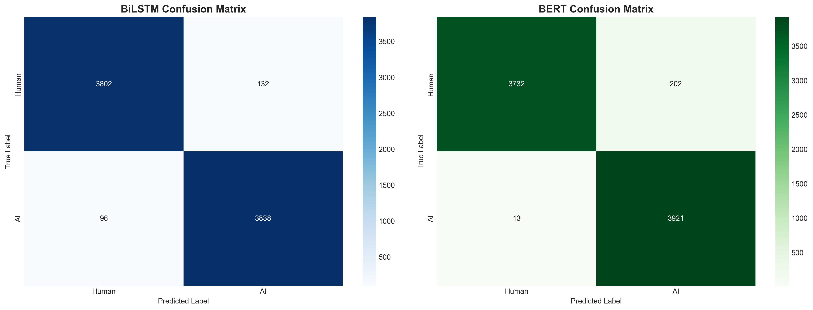
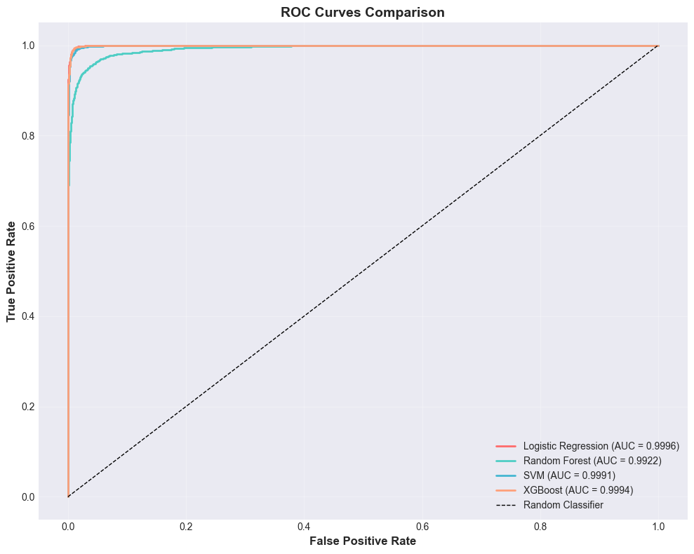
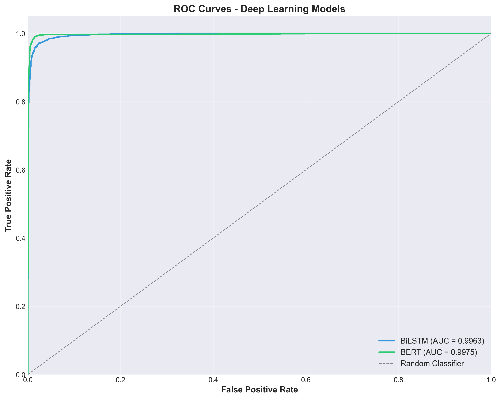
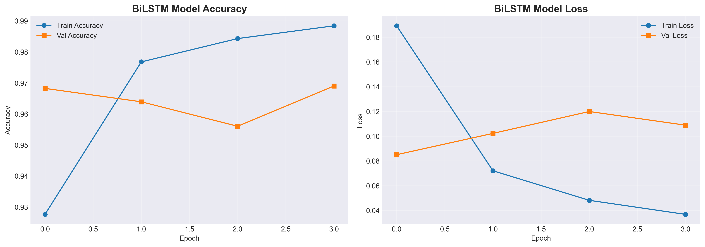
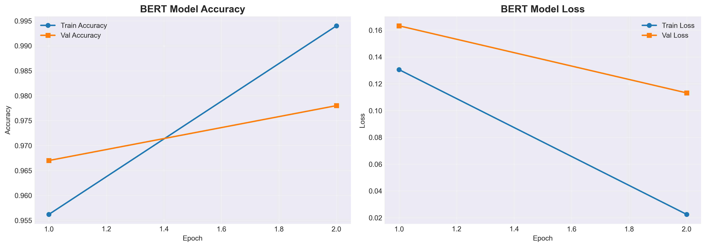
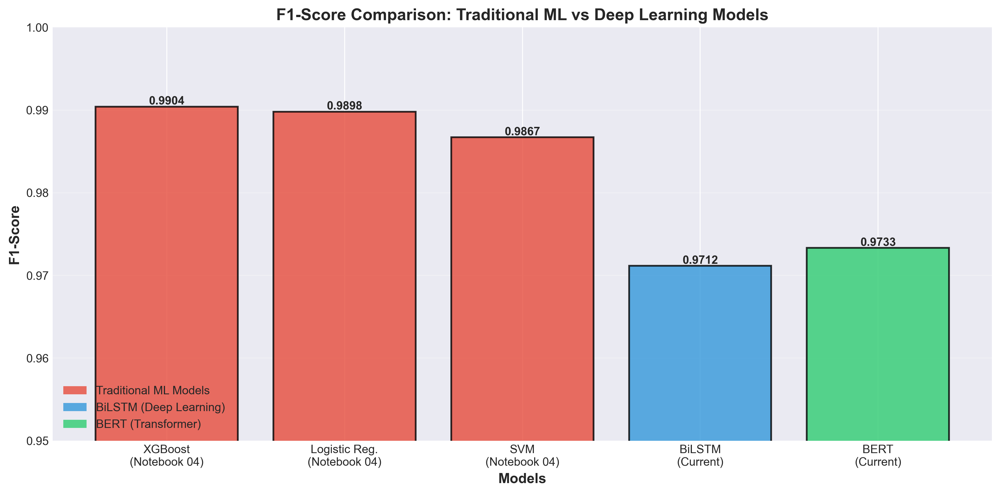
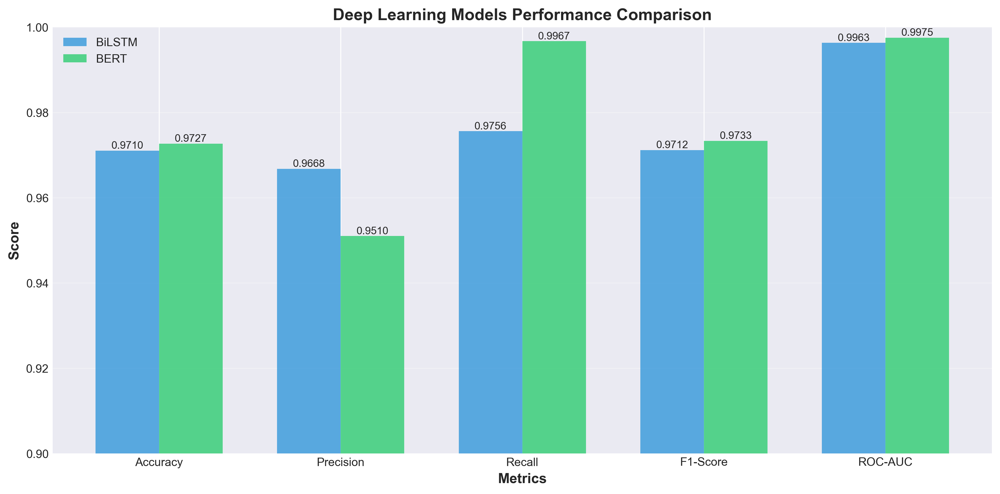

# 🤖 Human vs. AI Text Classification

[](https://www.python.org/downloads/)
[](https://opensource.org/licenses/MIT)
[](https://doi.org/10.5281/zenodo.18133069)
[](https://huggingface.co/huzaifanasirrr/human-vs-ai-text-classifier)
[](https://github.com/Huzaifanasir95/Human-vs-AI-Classifier)

> **A comprehensive ensemble-based text classification system achieving 99.59% F1-score in distinguishing human-written from AI-generated text**

---

## 📋 Table of Contents

- [Overview](#-overview)
- [Key Features](#-key-features)
- [Performance](#-performance)
- [Architecture](#-architecture)
- [Dataset](#-dataset)
- [Installation](#-installation)
- [Usage](#-usage)
- [Results](#-results)
- [Project Structure](#-project-structure)
- [Research Paper](#-research-paper)
- [Citation](#-citation)
- [Author](#-author)
- [License](#-license)
- [Acknowledgments](#-acknowledgments)

---

## 🎯 Overview

This project presents a **comprehensive study on binary text classification** to distinguish between human-written and AI-generated content. We implement and evaluate **6 diverse classifiers** (4 traditional ML + 2 deep learning) and combine them using **4 advanced ensemble techniques** to achieve state-of-the-art detection accuracy.

### 🌟 Key Achievements

- ✅ **99.59% F1-Score** with weighted ensemble
- ✅ **99.59% Precision & Recall** (perfectly balanced)
- ✅ **0.41% Error Rate** (32 errors out of 7,868 test samples)
- ✅ **0.9998 ROC-AUC** (near-perfect discrimination)
- ✅ Trained on **52,452 samples** from HC3 dataset
- ✅ **5 diverse domains**: Finance, Medicine, Open QA, Reddit ELI5, Wikipedia

---

## ⚡ Key Features

### 🔬 **6 Classification Models**
1. **Logistic Regression** - Linear baseline (98.98% F1)
2. **Random Forest** - 200-tree ensemble (95.73% F1)
3. **Support Vector Machine** - RBF kernel (98.67% F1)
4. **XGBoost** - Gradient boosting (99.04% F1) 🏆 Best Individual
5. **BiLSTM + Attention** - Recurrent neural network (97.12% F1)
6. **BERT** - Transformer-based (97.33% F1)

### 🎛️ **4 Ensemble Strategies**
- **Hard Voting** - Majority vote (99.21% F1)
- **Soft Voting** - Probability averaging (99.45% F1)
- **Weighted Average** - Optimized weights (99.59% F1) 🏆 Best Overall
- **Stacking** - Meta-learner (99.56% F1)

### 🧮 **Hybrid Feature Engineering**
- **5,000 TF-IDF features** (unigrams + bigrams)
- **15 linguistic features** (lexical diversity, text statistics, structural patterns)
- **Total: 5,015-dimensional feature space**

---

## 📊 Performance

### Individual Model Results

| Model | Accuracy | Precision | Recall | F1-Score | ROC-AUC |
|-------|----------|-----------|--------|----------|---------|
| **XGBoost** 🥇 | 99.03% | 98.38% | 99.70% | **99.04%** | 0.9994 |
| **Logistic Regression** 🥈 | 98.97% | 98.27% | 99.70% | **98.98%** | 0.9996 |
| **SVM** 🥉 | 98.67% | 98.07% | 99.29% | **98.67%** | 0.9991 |
| **BERT** | 97.27% | 95.10% | 99.67% | 97.33% | 0.9975 |
| **BiLSTM** | 97.10% | 96.68% | 97.56% | 97.12% | 0.9963 |
| **Random Forest** | 95.73% | 95.71% | 95.76% | 95.73% | 0.9922 |

### Ensemble Results

| Method | Accuracy | Precision | Recall | F1-Score | ROC-AUC |
|--------|----------|-----------|--------|----------|---------|
| **Weighted Average** 🏆 | **99.59%** | **99.59%** | **99.59%** | **99.59%** | **0.9998** |
| **Stacking** 🥈 | 99.56% | 99.47% | 99.64% | 99.56% | 0.9998 |
| **Soft Voting** 🥉 | 99.45% | 99.37% | 99.54% | 99.45% | 0.9998 |
| **Hard Voting** | 99.21% | 99.44% | 98.98% | 99.21% | 0.9998 |

### Confusion Matrix (Weighted Ensemble)

```
              Predicted
              Human    AI
Actual Human  3918     16    → 99.59% Recall
       AI     16       3918  → 99.59% Precision
```

**Error Analysis:**
- Total Errors: **32 / 7,868 (0.41%)**
- False Positives: **16** (Human classified as AI)
- False Negatives: **16** (AI classified as Human)
- **Perfectly balanced error distribution**

---

## 🏗️ Architecture


*Figure 1: Performance comparison across all six classification models*

### System Pipeline

```
Input Text
    ↓
[Feature Engineering]
    ├─→ TF-IDF Vectorization (5,000 features)
    │   • Unigrams & Bigrams
    │   • Max DF: 0.95, Min DF: 2
    │
    └─→ Linguistic Features (15 features)
        • Text statistics (length, word/sentence counts)
        • Lexical diversity (Type-Token Ratio)
        • Character ratios (stopwords, punctuation, digits)
    ↓
Multi-Modal Feature Vector (5,015 dimensions)
    ↓
┌──────────────────────────────────────────────┐
│         Base Classifiers (Parallel)          │
├──────────────────────────────────────────────┤
│ Traditional ML          │ Deep Learning      │
├─────────────────────────┼────────────────────┤
│ • Logistic Regression   │ • BERT             │
│ • Random Forest         │   (bert-base)      │
│ • SVM (RBF kernel)      │ • BiLSTM+Attention │
│ • XGBoost               │   (64 units)       │
└─────────────────────────┴────────────────────┘
    ↓
[Ensemble Aggregation]
    ├─→ Hard Voting
    ├─→ Soft Voting
    ├─→ Weighted Average (w_XGB=0.25, w_LR=0.20, ...)
    └─→ Stacking (Meta-learner: Logistic Regression)
    ↓
Final Prediction: Human (0) or AI (1)
```

### Ensemble Comparison


*Figure 2: Comprehensive comparison of ensemble methods showing F1-scores, confusion matrix, and ROC curves*

---

## 📂 Dataset

**HC3 (Human-ChatGPT Comparison Corpus)**

| Attribute | Value |
|-----------|-------|
| **Total Samples** | 52,452 |
| **Training** | 36,716 (70%) |
| **Validation** | 7,868 (15%) |
| **Test** | 7,868 (15%) |
| **Classes** | 2 (Human, AI) |
| **Balance** | 50-50 |
| **Min Length** | 50 characters |

**Domains:**
- 💰 **Finance** - Financial domain-specific content
- 🏥 **Medicine** - Medical and healthcare-related text
- 💬 **Open QA** - General question-answering pairs
- 📱 **Reddit ELI5** - Explanations for complex topics
- 📚 **Wikipedia (CS/AI)** - Computer science and AI articles

---

## 🚀 Installation

### Prerequisites

- Python 3.8+
- pip
- (Optional) GPU with CUDA for deep learning models

### Quick Start

```bash
# Clone repository
git clone https://github.com/Huzaifanasir95/Human-vs-AI-Classifier.git
cd Human-vs-AI-Classifier

# Install dependencies
pip install -r requirements.txt

# Download pre-trained models from Hugging Face
python scripts/download_models.py
```

### Install from Requirements

```bash
pip install -r requirements.txt
```

**Key Dependencies:**
- `scikit-learn>=1.3.0` - Traditional ML models
- `xgboost>=1.7.0` - Gradient boosting
- `tensorflow>=2.13.0` - BiLSTM model
- `torch>=2.0.0` - BERT model
- `transformers>=4.30.0` - BERT architecture
- `pandas>=2.0.0` - Data processing
- `numpy>=1.24.0` - Numerical operations
- `matplotlib>=3.7.0` - Visualization
- `seaborn>=0.12.0` - Statistical plots

---

## 💻 Usage

### 1. Download Pre-trained Models

```python
from huggingface_hub import hf_hub_download
import pickle

# Download XGBoost (best individual model)
model_path = hf_hub_download(
    repo_id="huzaifanasirrr/human-vs-ai-text-classifier",
    filename="models/xgboost.pkl"
)

with open(model_path, 'rb') as f:
    xgb_model = pickle.load(f)
```

### 2. Feature Extraction

```python
from src.feature_extractor import FeatureExtractor

# Initialize feature extractor
extractor = FeatureExtractor(
    max_features=5000,
    ngram_range=(1, 2)
)

# Extract features
text = "Your text to classify here..."
features = extractor.extract(text)  # Shape: (5015,)
```

### 3. Single Model Prediction

```python
# Predict with XGBoost
prediction = xgb_model.predict(features.reshape(1, -1))[0]
probability = xgb_model.predict_proba(features.reshape(1, -1))[0]

print(f"Prediction: {'AI-generated' if prediction else 'Human-written'}")
print(f"Confidence: {probability[prediction]:.2%}")
```

### 4. Ensemble Prediction

```python
from src.models.ensemble import WeightedEnsemble

# Load all models
models = {
    'xgboost': xgb_model,
    'logistic': lr_model,
    'svm': svm_model,
    'rf': rf_model,
    'bert': bert_model,
    'bilstm': bilstm_model
}

# Create weighted ensemble
ensemble = WeightedEnsemble(
    models=list(models.values()),
    weights=[0.25, 0.20, 0.15, 0.10, 0.20, 0.10]
)

# Predict
prediction = ensemble.predict(features)
probability = ensemble.predict_proba(features)

print(f"Ensemble Prediction: {'AI' if prediction else 'Human'}")
print(f"Confidence: {probability[prediction]:.2%}")
```

### 5. Run Jupyter Notebooks

Explore the complete workflow through interactive notebooks:

```bash
jupyter notebook notebooks/
```

**Available Notebooks:**
1. `01_data_exploration.ipynb` - Dataset analysis and visualization
2. `02_data_collection_preprocessing.ipynb` - Data cleaning and preparation
3. `03_feature_engineering.ipynb` - TF-IDF and linguistic feature extraction
4. `04_traditional_models.ipynb` - Training Logistic Regression, RF, SVM, XGBoost
5. `05_deep_learning_models.ipynb` - Training BiLSTM and BERT
6. `06_ensemble_methods.ipynb` - Ensemble strategies and final evaluation

---

## 📈 Results

### Confusion Matrices


*Figure 3: Confusion matrices for traditional machine learning models*


*Figure 4: Confusion matrices for deep learning models (BiLSTM and BERT)*

### ROC Curves


*Figure 5: ROC curves for traditional ML models (AUC > 0.99)*


*Figure 6: ROC curves for deep learning models*

### Training Dynamics


*Figure 7: BiLSTM training history showing accuracy and loss over 4 epochs*


*Figure 8: BERT fine-tuning history showing training progress*

### Performance Comparison


*Figure 9: Comprehensive F1-score comparison across all models*


*Figure 10: Detailed performance metrics for deep learning models*

### Feature Importance

**Top Features (XGBoost Analysis):**

| Feature Type | Importance |
|--------------|-----------|
| TF-IDF Features | 89.2% |
| Average Sentence Length | 4.3% |
| Lexical Diversity (TTR) | 2.7% |
| Unique Words Ratio | 1.5% |
| Average Word Length | 1.1% |
| Others | 1.2% |

**Insight:** Vocabulary patterns dominate, but linguistic features provide crucial complementary information.

---

## 📁 Project Structure

```
Human-vs-AI-Classifier/
├── 📂 configs/
│   └── config.yaml                 # Project configuration
├── 📂 data/
│   ├── raw/                        # HC3 dataset
│   └── processed/                  # Preprocessed data
├── 📂 notebooks/
│   ├── 01_data_exploration.ipynb
│   ├── 02_data_collection_preprocessing.ipynb
│   ├── 03_feature_engineering.ipynb
│   ├── 04_traditional_models.ipynb
│   ├── 05_deep_learning_models.ipynb
│   └── 06_ensemble_methods.ipynb
├── 📂 src/
│   ├── __init__.py
│   ├── feature_extractor.py       # Feature engineering
│   ├── evaluation.py               # Metrics and evaluation
│   ├── inference.py                # Prediction pipeline
│   ├── data/
│   │   ├── data_loader.py
│   │   └── preprocessor.py
│   └── models/
│       ├── traditional_models.py
│       ├── deep_models.py
│       └── ensemble.py
├── 📂 outputs/
│   ├── visualizations/             # All generated plots
│   ├── predictions/                # Model predictions
│   └── reports/                    # Evaluation reports
├── 📂 models/
│   └── saved_models/               # Trained model checkpoints
├── 📂 Report/
│   ├── main.tex                    # Research paper (LNCS format)
│   └── *.png                       # All figures
├── 📂 tests/
│   └── test_*.py                   # Unit tests
├── app.py                          # Gradio web interface
├── requirements.txt                # Dependencies
├── upload_to_huggingface.py        # HF Hub upload script
├── LICENSE                         # MIT License
└── README.md                       # This file
├── configs/
│   └── config.yaml             # Configuration file
├── tests/                      # Unit tests
├── app.py                      # Streamlit web interface
├── requirements.txt
└── README.md
```

## 🚀 Getting Started

### Prerequisites

- Python 3.8+
- pip or conda

### Installation

1. Clone the repository:
```bash
git clone https://github.com/Huzaifanasir95/Human-vs-AI-Classifier.git
cd Human-vs-AI-Classifier
```

2. Create a virtual environment:
```bash
python -m venv venv
source venv/bin/activate  # On Windows: venv\Scripts\activate
```

3. Install dependencies:
```bash
pip install -r requirements.txt
```

4. Download required NLP models:
```bash
python -m spacy download en_core_web_sm
python -c "import nltk; nltk.download('punkt'); nltk.download('stopwords')"
```

## 💻 Usage

### 1. Data Preparation

Place your dataset in `data/raw/` and run the preprocessing notebook:
```bash
jupyter notebook notebooks/02_data_preprocessing.ipynb
```

### 2. Train Models

Run the training script:
```bash
python scripts/train_models.py --config configs/config.yaml
```

Or use individual notebooks for step-by-step training.

### 3. Evaluate Models

```bash
```

---

## 📄 Research Paper

The complete research paper is available in **SPRINGER LNCS format**:

📑 **[View on Zenodo](https://doi.org/10.5281/zenodo.18133069)** (DOI: 10.5281/zenodo.18133069)

**Contents:**
- ✅ Complete methodology with mathematical formulations
- ✅ Comprehensive experimental results (14 tables & figures)
- ✅ Feature importance analysis
- ✅ Training dynamics and complexity analysis
- ✅ Discussion of limitations and ethical considerations
- ✅ Future research directions
- ✅ Full bibliography (10 key references)

---

## 📚 Citation

If you use this work in your research, please cite:

### BibTeX

```bibtex
@article{nasir2025humanaiclassifier,
  title={Human vs. AI Text Classification: A Comprehensive Study Using Machine Learning and Deep Learning Approaches},
  author={Nasir, Huzaifa},
  institution={National University of Computer and Emerging Sciences, Pakistan},
  year={2025},
  doi={10.5281/zenodo.18133069},
  url={https://doi.org/10.5281/zenodo.18133069},
  note={Hugging Face: https://huggingface.co/huzaifanasirrr/human-vs-ai-text-classifier}
}
```

### APA

```
Nasir, H. (2025). Human vs. AI Text Classification: A Comprehensive Study Using 
Machine Learning and Deep Learning Approaches. National University of Computer 
and Emerging Sciences, Pakistan. https://doi.org/10.5281/zenodo.18133069
```

### IEEE

```
H. Nasir, "Human vs. AI Text Classification: A Comprehensive Study Using Machine 
Learning and Deep Learning Approaches," National University of Computer and 
Emerging Sciences, Pakistan, 2025. doi: 10.5281/zenodo.18133069
```

---

## 👤 Author

**Huzaifa Nasir**

- 🎓 National University of Computer and Emerging Sciences (FAST-NUCES)
- 📧 Email: [nasirhuzaifa95@gmail.com](mailto:nasirhuzaifa95@gmail.com)
- 🆔 ORCID: [0009-0000-1482-3268](https://orcid.org/0009-0000-1482-3268)
- 💼 LinkedIn: [huzaifa-nasir-](https://www.linkedin.com/in/huzaifa-nasir-)
- 🐙 GitHub: [@Huzaifanasir95](https://github.com/Huzaifanasir95)
- 🤗 Hugging Face: [@huzaifanasirrr](https://huggingface.co/huzaifanasirrr)

---

## 📜 License

This project is licensed under the **MIT License** - see the [LICENSE](LICENSE) file for details.

**You are free to:**
- ✅ Use commercially
- ✅ Modify
- ✅ Distribute
- ✅ Private use

**Under the condition that:**
- 📋 License and copyright notice must be included

---

## 🙏 Acknowledgments

This project builds upon outstanding work from the research community:

### Datasets & Frameworks
- **[HC3 Dataset](https://arxiv.org/abs/2301.07597)** - Guo et al., 2023 (Human-ChatGPT Comparison Corpus)
- **[BERT](https://arxiv.org/abs/1810.04805)** - Devlin et al., 2018 (Pre-trained language models)
- **[XGBoost](https://arxiv.org/abs/1603.02754)** - Chen & Guestrin, 2016 (Gradient boosting)
- **[Transformers](https://huggingface.co/transformers/)** - Hugging Face (NLP library)
- **[Scikit-learn](https://scikit-learn.org/)** - Pedregosa et al., 2011 (ML library)

### Research Inspiration
- Solaiman et al., 2019 - "Release strategies and the social impacts of language models"
- Vaswani et al., 2017 - "Attention is all you need"
- Hochreiter & Schmidhuber, 1997 - "Long short-term memory"
- Wolpert, 1992 - "Stacked generalization"

### Special Thanks
- 🏫 **FAST-NUCES Islamabad** - Research facilities and support
- 🌍 **Open Source Community** - For PyTorch, TensorFlow, and countless libraries
- 🤗 **Hugging Face** - For model hosting and sharing infrastructure
- 📚 **Zenodo** - For permanent archival and DOI assignment

---

## 🔗 Links

- 🌐 **Live Demo**: Coming soon (Gradio/Streamlit)
- 📦 **Hugging Face Models**: [huzaifanasirrr/human-vs-ai-text-classifier](https://huggingface.co/huzaifanasirrr/human-vs-ai-text-classifier)
- 📑 **Research Paper (Zenodo)**: [10.5281/zenodo.18133069](https://doi.org/10.5281/zenodo.18133069)
- 🐙 **GitHub Repository**: [Human-vs-AI-Classifier](https://github.com/Huzaifanasir95/Human-vs-AI-Classifier)
- 📊 **Dataset**: [HC3 on Hugging Face](https://huggingface.co/datasets/Hello-SimpleAI/HC3)

---

## 📞 Contact & Support

### Questions or Issues?
- 💬 Open an [Issue](https://github.com/Huzaifanasir95/Human-vs-AI-Classifier/issues)
- 📧 Email: [nasirhuzaifa95@gmail.com](mailto:nasirhuzaifa95@gmail.com)

### Contributions Welcome!
We welcome contributions! Please see [CONTRIBUTING.md](CONTRIBUTING.md) for guidelines.

**Areas for contribution:**
- 🌍 Multilingual support
- 🎯 Improved ensemble strategies
- 🚀 Production deployment scripts
- 🧪 Additional test cases
- 📚 Documentation improvements

---

## 🌟 Star History

[](https://star-history.com/#Huzaifanasir95/Human-vs-AI-Classifier&Date)

---

## 📊 Stats


---

<div align="center">

**⭐ If you find this project useful, please consider giving it a star! ⭐**

**Made with ❤️ by [Huzaifa Nasir](https://github.com/Huzaifanasir95)**

</div>
